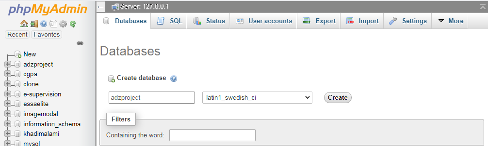

# adzproject
Apartment Rental Web Application.

REQUIREMENT

1. Get XAMPP on your local machine: 
[download!](https://www.apachefriends.org/)

2. Download the zip file of this repo: 
[download!](https://github.com/mdjibril/adzproject/archive/main.zip)

or clone the repo to your local machine:
Note: Make Sure to Clone to **htdocs folder** directly.
[clone!](https://github.com/mdjibril/adzproject/archive/main.zip)
    
before cloning make sure you already have **gitbash** installed you can verify by typing **git** from your CMD or go here to 
[download!](https://git-scm.com/downloads)
 
3. Unzip it and copy the folder to **htdocs** folder inside the XAMPP directory

4. Launch your XAMPP software then start the *Apache* and *MySQl* module

# Setup Database
1. From the XAMPP software interface Click the *admin button* for MySQL
or simply type `https://localhost/phpmyadmin` on your browser

2. On the left navigation panel click on *new* the name of the *db* you are creating is **adzproject**

3. After successfly creating, click on the dbname on the right navigation pane

4. inside the project folder you unzipped or you cloned, there is a file named `adzproject.sql` copy the content of the file

5. click on the SQL on the top navbar then paste in the textarea provided, click on **go** at the right bottom of the page 

6. After successflly creating you should see the tables under the DB at the right navigation panel

7. Horray You Just setup your Local DB

# Launch Project
1. Navigate to `https://localhost/adzproject` to view the application
